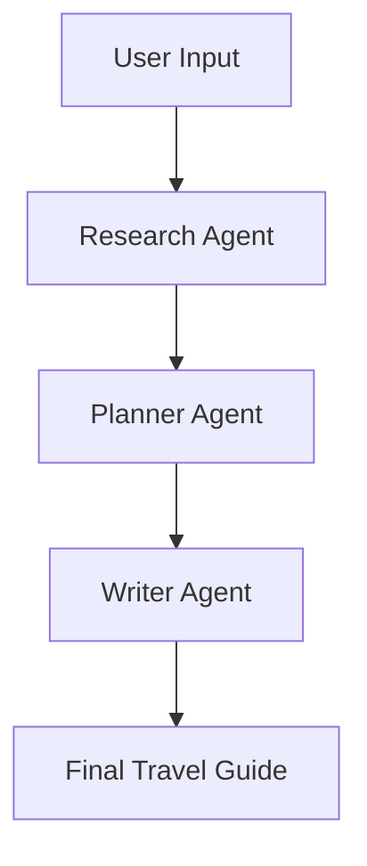

# ✈️ GG-BOND Travel Assistant

A **multi-agent AI travel planning system** that automatically generates personalized travel plans using LLMs.

Built with a modular architecture (**Research → Planner → Writer**) to simulate real-world intelligent decision-making pipelines.

---

## 🚀 Features

* 🧠 **Multi-Agent Architecture**

  * Research Agent → collects structured travel insights
  * Planner Agent → builds a realistic itinerary
  * Writer Agent → converts plans into user-friendly guides

* 📍 **Personalized Travel Planning**

  * Destination-based recommendations
  * User preference-aware planning
  * Balanced daily schedules

* 🧾 **Structured + Readable Outputs**

  * JSON for system processing
  * Human-readable itinerary (via Writer Agent)

* ⚙️ **LLM Integration via OpenRouter**

  * Flexible model configuration
  * Easy to switch models via `.env`

---

## 🏗️ Project Structure

```
GG-BOND-travel-assistant/
├── agents/
│   ├── __init__.py
│   ├── research_agent.py     # Collects structured travel data
│   ├── planner_agent.py      # Generates itinerary (JSON)
│   ├── writer_agent.py       # Converts plan to readable guide
│
├── main.py                   # Pipeline entry point
├── requirements.txt          # Dependencies
├── .env.example              # Environment variables template
├── README.md
```

---

## 🧠 How It Works



### 1. Research Agent

* Gathers:

  * Recommended areas
  * Attractions
  * Planning hints
  * Constraints
* Outputs structured JSON

### 2. Planner Agent

* Builds:

  * Day-by-day itinerary
  * Meal + lodging suggestions
  * Budget estimation
* Ensures:

  * Logical flow
  * Realistic pacing
  * Minimal hallucination

### 3. Writer Agent

* Converts JSON into:

  * Readable travel guide
  * Narrative-style itinerary

---

## 🙌 Acknowledgements

* OpenAI / OpenRouter
* Python ecosystem
